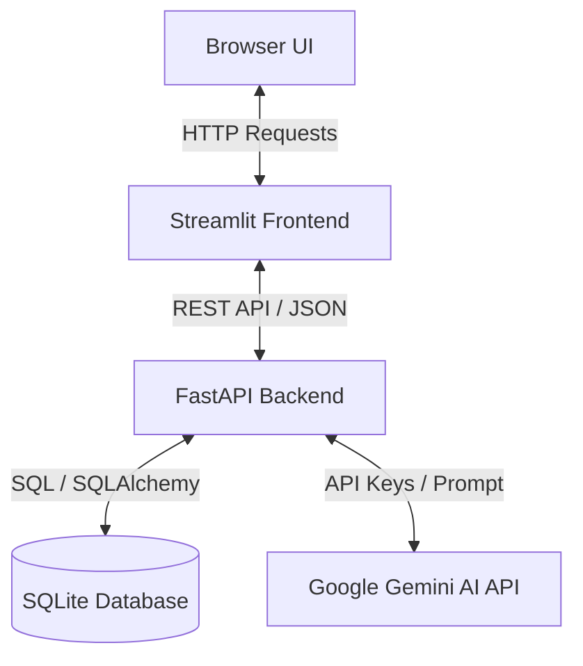

# 🎓 AI Code Reviewer — Project Viva Study Guide

This document is a cheat sheet to help you prepare for your college project viva/defense. It explains the project architecture, tech stack, codebase flow, and contains answers to the most common questions a project examiner or professor might ask.

---

## 1. Project Overview & Architecture

The **AI Code Reviewer** is a full-stack web application that uses Generative AI (Google Gemini Pro) to analyze code files, detect bugs/security issues/performance smells, and provide a refactored version of the code with clean-code comments.

### Tech Stack
*   **Frontend UI:** **Streamlit** (Python-based dashboard and UI web framework).
*   **Backend API:** **FastAPI** (High-performance, asynchronous, production-ready Python API framework).
*   **Database:** **SQLite** (Local, file-based relational database).
*   **ORM:** **SQLAlchemy** (Object-Relational Mapping library in Python).
*   **AI Integration:** **Google Gemini API** (via `google-generativeai` SDK).
*   **Visualizations:** **Plotly** (For interactive dashboard charts).

### System Architecture Diagram

---

## 2. Codebase Flow (How it Works)

1.  **Authentication:** The user logs in or registers. The backend verifies credentials, signs a secure **JWT Token** (JSON Web Token), and sends it to the frontend. The frontend stores it in `st.session_state` and attaches it as a `Bearer Token` to all subsequent API headers.
2.  **Code Submission:** The user selects a language (Python, Javascript, Java, C++, C), pastes code, and submits.
3.  **AI Analysis & Parsing:** 
    *   The FastAPI backend receives the request and forwards the code and a highly structured **system prompt** to the Gemini API.
    *   Gemini returns a stringified JSON object containing overall scores, categorised issues, suggested fixes, and a rewritten clean version.
    *   The backend validates/cleans the JSON string and falls back to a clean parser error format if the AI response is malformed.
4.  **Database Storage:** The review details (original code, scores, issues, improved code, timestamp) are stored in the SQLite database under the user's ID.
5.  **Dashboard & History:** 
    *   The **Dashboard** calls `/api/dashboard/stats` to run SQL aggregation queries (averages, counts, group-bys) and draws Plotly charts.
    *   The **History** page fetches all past reviews in chronological order.

---

## 3. Top 10 Viva Questions & Short, Simple Answers

### Q1: What is the main purpose of this project?
> **Answer:** To build a developer productivity tool that acts as an automated senior engineer. It uses AI to identify logic bugs, security vulnerabilities (like SQL injections/XSS), performance loops, and code smells, and instantly generates clean, refactored replacement code.

### Q2: Why did you choose FastAPI instead of Django or Flask for the backend?
> **Answer:** FastAPI is modern, extremely fast (on par with Node.js and Go), supports native asynchronous programming (`async/await`), and automatically generates interactive Swagger API documentation (`/docs`), which makes it perfect for connecting microservices and AI endpoints.

### Q3: Why did you use Streamlit for the frontend?
> **Answer:** Streamlit allows building clean, interactive, data-driven dashboard layouts purely in Python. It has built-in state management (`st.session_state`), and allows quick dashboard deployment without writing complex HTML/CSS/React boilerplates.

### Q4: How does the AI know to return structured JSON instead of plain conversation text?
> **Answer:** This is achieved through **Prompt Engineering** in `gemini_service.py`. We send a strict **System Context** instructing the model to behave as a Code Security Analyst, combined with a detailed JSON structure template that the model *must* populate. We also implement a fallback JSON parsing mechanism (`json.loads`) to clean and repair the output.

### Q5: How is user authentication secured?
> **Answer:** We use **JWT (JSON Web Token) authentication**. When a user logs in, the backend hashes the password (using `passlib`/`bcrypt`), compares it to the database record, and signs an encrypted access token containing the user's ID. This token is sent with every subsequent HTTP header as a `Bearer Token`.

### Q6: Why did you choose SQLite?
> **Answer:** SQLite is a self-contained, serverless database engine. It stores data locally in a single file (`ai_code_reviewer.db`), eliminating the need to configure a separate PostgreSQL or MySQL server. It is ideal for local development, testing, and college project demonstrations.

### Q7: How does database communication happen in Python?
> **Answer:** We use **SQLAlchemy ORM** (Object-Relational Mapping). We define Python classes as schemas (e.g., `User` and `CodeReview`), and SQLAlchemy translates our Python operations (like `db.add()` or `db.query()`) into SQL statements behind the scenes.

### Q8: What features did you implement on the Dashboard?
> **Answer:** The dashboard provides key metrics: Total Reviews, Average Score, Total Issues Found, and High Severity count. It also renders visual breakdowns: Average Scores per category (Bar Chart) and Language Distribution (Pie Chart) generated dynamically using **Plotly**.

### Q9: How does the frontend handle collapsibility/toggle of the navigation sidebar?
> **Answer:** It uses Streamlit's native sidebar layout (`with st.sidebar:`). We implemented custom CSS to hide default Streamlit developer menus while maintaining the toggle control (`[data-testid="collapsedControl"]`) so users can easily expand or collapse the menu.

### Q10: What are the future enhancements or scaling possibilities for this project?
> **Answer:**
> 1. Integrate with GitHub webhooks so code is reviewed automatically on every `git push` or pull request.
> 2. Implement background worker task queues (like **Celery** with **Redis**) to handle very large repositories without blocking the web page.
> 3. Switch SQLite to **PostgreSQL** in production to support high concurrent traffic.

---

## 4. Key Files to Know Inside Out

*   `app.py` (The frontend layout, state management, forms, and pages).
*   `gemini_service.py` (Prompt engineering and AI configuration).
*   `config.py` (Environment configuration and API key load).
*   `review_service.py` (Logic matching FastAPI requests with DB actions and AI calling).
